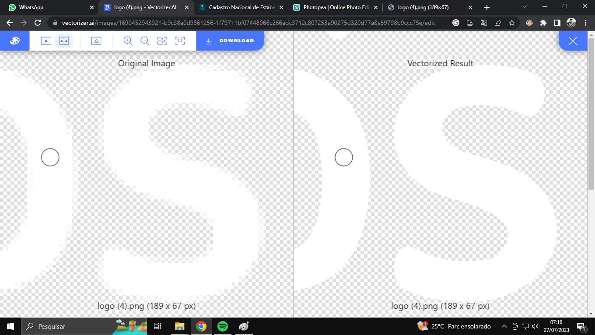

# Projeto de Teste MandaTrends

Esse projeto foi feito para minha apresentação de conhecimentos técnicos na vaga de estágio na empresa Mandarin.

## Tecnologias Utilizadas 
    - HTML
    - CSS

Decidi utilizar o [Vectorize AI](https://vectorize.ai "Vectorize AI") para auxiliar a melhorar a qualidade das logos que mesmo sendo exportadas do PSD, estavam em uma resolução bem baixa. logo abaixo vemos um exemplo da sutileza na melhoria da qualidade.

## Caso queira visualizar o projeto diretamente online é possivel [Clicando Aqui](https://honassis.com.br/mandatrends) dentro do meu site profissional.
